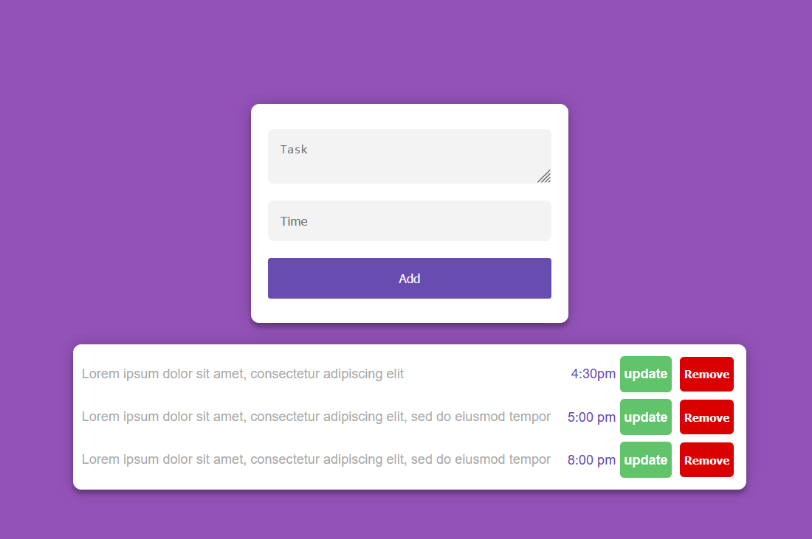

# Todo List React - Redux App :)

Todo List app using **React**,**Redux** and **ReactRouter**.
This project was bootstrapped using [Vite](https://vitejs.dev/)

See the [Live Project](https://maxjn-todolist-redux.pages.dev/).

# Technologies

- React
- **Redux** for state management
- **Toastify** package for toast messages
- **uuid** package for generating unique ids
- useState & useEffects , useParams... Hooks
- HTML, CSS

# Features

- CRUD Actions
- Adding tasks to list
- Showing tasks list
- Removing tasks from list
- Updating tasks

# Installing / Getting started

```shell
npm install

npm run dev
```

# Image


